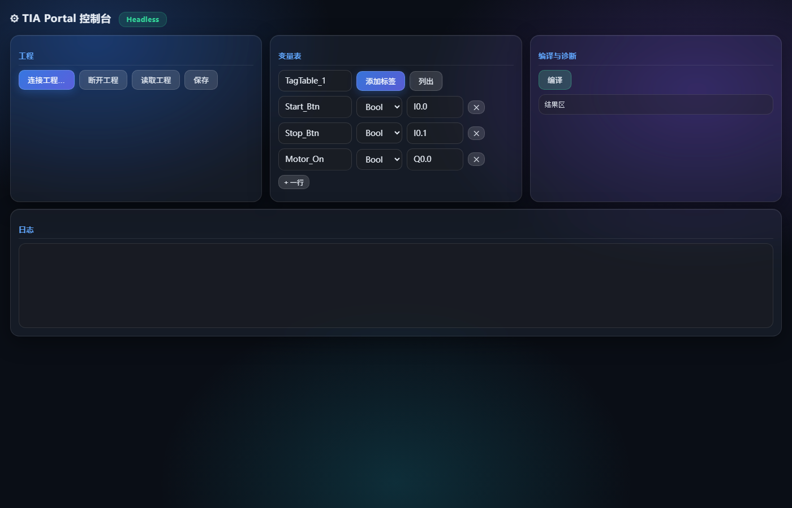

# TIA Openness Worker — AI 直连博途

让 AI(Claude Code)通过西门子 Openness API **直接读写你的 TIA Portal 工程**:
建工程、加 CPU、写变量表、写 SCL 程序、生成 LAD 梯形图、编译诊断、自动修复、读取分析、生成报告、HMI 画面——全程在你开着的博途界面实时可见。

> 灵感来自微信文章《西门子 TIA Portal 也能被 AI 调用?Openness API 接入全流程来了》
> 并参考了社区项目 [bulaofen0036-coder/TIA_Portal_Openness_MCP](https://github.com/bulaofen0036-coder/TIA_Portal_Openness_MCP)(SimaticML 格式)

## 能力一览

| 能力 | 说明 |
|---|---|
| 工程/CPU | 新建工程、添加 S7-1500 CPU、打开/切换工程 |
| 变量表 | 批量添加标签(中文变量名可用),读取全量 |
| SCL 程序 | 任意 SCL 导入生成块,**中文注释/中文变量名可用** |
| LAD 梯形图 | 12 个配方生成器(自锁/闪烁/TON/TOF/TP/计数器/沿/置位复位/比较/算术),FB/FC 都支持 |
| 编译诊断 | 结构化错误反馈(块名+描述),AI 修复循环 |
| 读取分析 | 块列表/变量表/块内容导出(SCL 文本/SimaticML XML) |
| 模板库 | 交通灯/电机正反转/计数分拣,一句话生成完整 FB |
| 报告 | 工程内容一键生成 Markdown 文档 |
| HMI 画面 | 经典 WinCC 画面生成(按钮/指示灯/文本) |
| 仿真下载 | PLCSIM 启动与下载(部分功能) |
| Web 面板 | 零依赖浏览器控制台,点按钮操作博途 |

## 架构

```
Claude Code / 浏览器
   │  MCP 工具 / HTTP API
   ▼
mcp_server.py / web_ui(自动 Attach 到用户已开的博途)
   │  JSON 行协议(stdin/stdout)
   ▼
TiaOpennessWorker.exe(serve 长驻,一次启动博途服务多请求)
   │  Openness API
   ▼
TIA Portal(用户界面实时可见)
```

## 快速开始

### 前提(硬性)

- 完整版 TIA Portal V21(安装时勾选 **Openness** 组件;非标准安装目录用 `-p:TiaApiDir` / 环境变量指定)
- Windows 10/11;当前用户属于 **Siemens TIA Openness** 组
- 首次连接时在博途弹窗选择"始终允许"(Openness 防火墙授权)
- .NET SDK(构建用)与 Python 3.10+

### 构建

```bash
# 标准安装位置(默认 C:\Program Files\Siemens\Automation\Portal V21)
dotnet build src/TiaOpennessWorker/TiaOpennessWorker.csproj

# 非标准安装(如 D 盘)
dotnet build src/TiaOpennessWorker/TiaOpennessWorker.csproj \
    -p:TiaApiDir="D:\你的路径\Portal V21\PublicAPI\V21\net48"
```

### 接入 Claude Code(MCP)

```bash
claude mcp add --scope user tia-openness -- python D:/路径/mcp/mcp_server.py
```

重启会话后即可使用 20 个工具:`create_project` / `add_tags` / `import_scl` /
`generate_lad_block` / `generate_scl_template` / `compile_project` /
`read_project` / `generate_hmi_screen` / `save_archive` / `shutdown` …

### Web 面板

```bash
python web_ui/server.py
# 浏览器打开 http://127.0.0.1:8000
```



工程管理 / 变量表编辑 / 模板与 LAD 生成 / SCL 粘贴导入(中文注释可用)/ 编译诊断 / 实时日志,零依赖纯标准库。

### AI 助手(浏览器里直接聊天控制博途)

面板顶部的 **AI 助手** 用自然语言控制博途:AI(通义千问)自主决定调用工具
(连接工程 / 加变量表 / 导 SCL / 编梯形图 / 编译诊断),工具执行过程以步骤条显示在聊天区。

```bash
# 需要 DashScope(阿里云百炼)API key,配置优先级:
#   1. config.json 的 "llm": {"api_key": "...", "model": "qwen-max"}
#   2. 环境变量 DASHSCOPE_API_KEY
#   3. 复用 ~/qwen-vision-mcp/.env 已有的 QWV_API_KEY(自动发现)
```

示例提问:"给我建一个电机启停自锁的梯形图块,再加 3 个中文变量"。

### 直接命令行(调试)

```bash
# 完整闭环:建工程→加CPU→导入SCL→编译→归档
TiaOpennessWorker.exe run --scl samples/GoodSample.scl --out output
```

## LAD 配方(gen-lad 的 spec.networks[].recipe)

`contact_coil` / `self_lock`(启停自锁)/ `blink`(TON 闪烁)/ `tof` / `tp` /
`counter`(CTU/CTD)/ `pulse`(PBox/NBox 沿)/ `set` / `reset` /
`compare`(Eq/Ne/Gt/Ge/Lt/Le)/ `arith`(Add/Sub/Mul/Div/Mod)

示例(samples/led_spec.json):`self_lock` + `blink` 组成 LED 控制 FB。

## 关键实现点(踩过的坑都在这)

- **LAD = SimaticML XML**:梯形图不是文本,用"配方 → SimaticML XML → Blocks.Import"导入;
  XML 必须 UTF-8 **BOM**;每个 Wire 引用要独立 Access 节点;并联分支=一条 Wire 带多个 NameCon;
  一个网络只能一条 Powerrail;O 盒 Card 模板值 Type="Cardinality";Add/Mul 必须显式 Card 而 Sub/Div 不能带
- **SCL 中文**:源文件统一转 UTF-8 BOM 再导入,TIA 靠 BOM 识别编码,中文变量/中文注释直接可用
- **SCL 规则**:一个 FB 实例只能调用一次(多条件用单次调用+布尔表达式);OB 的 TEMP 区不能放 FB 实例(用背景 DB)
- **只支持 Attach(必须可见)**:必须手动打开博途窗口,worker 附着进用户实例,写进界面正在看的工程、实时可见;
  未开博途 → 明确报错"请先打开博途窗口",不启动无界面实例;多实例用 `list-instances` / `attach-instance`
- **环境韧性**:启动前清理残留 Siemens 进程;150s 看门狗;超时自动重试(60s);WMI 故障/内存不足时 TIA 启动会静默挂起

## 目录结构

```
src/TiaOpennessWorker/     C# Worker(net48,Openness V21)
mcp/mcp_server.py          MCP stdio 服务器(20 工具)
web_ui/                    零依赖 Web 面板
samples/                   示例 SCL/LAD spec/模板库/赛题复刻
scratch/DumpApi/           Openness API 反射探测工具
```

## 已知限制

- **工艺对象(轴)无法自动创建**(西门子 Openness 限制,需界面手动添加);轴建好后 MC 指令可写
- 经典 WinCC(HMI)连接无法自动建立(Openness 无 API),需界面手动拉一条(15 秒);Unified 屏需完整版组件
- 位置/速度在示例 FB 中为模拟积分,接真实工艺对象后替换为 MC 指令/编码器反馈

## License

MIT
